# 图书馆管理系统（library-main）


## 本地快捷预览项目

第一步：进入Spring Boot文件，找到Application.properties文件，修改自己数据库名称和密码

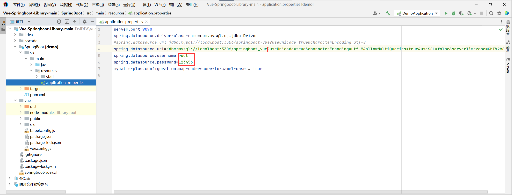

第二步：在Navicat中打开外部查询，读取springboot_vue.sql文件，并运行

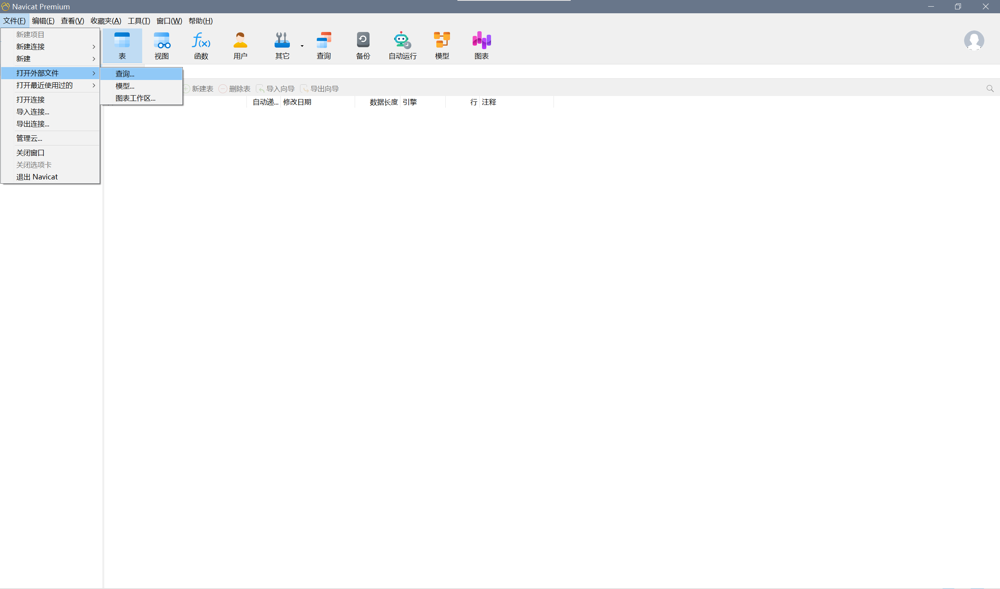

第三步：右键pom.xml,添加到Maven

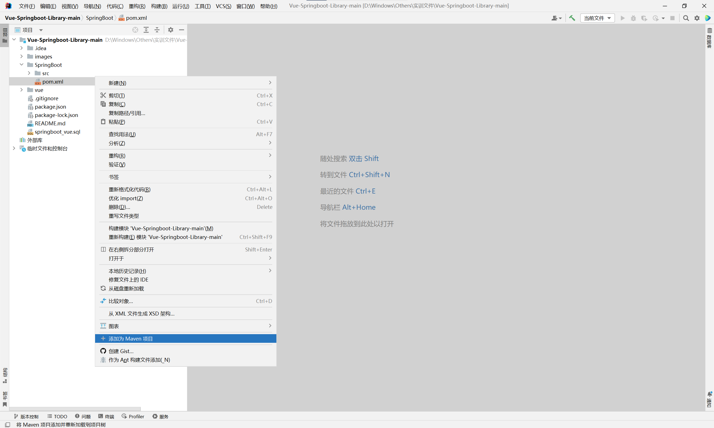

第四步：右侧工具栏Maven选项，并执行操作

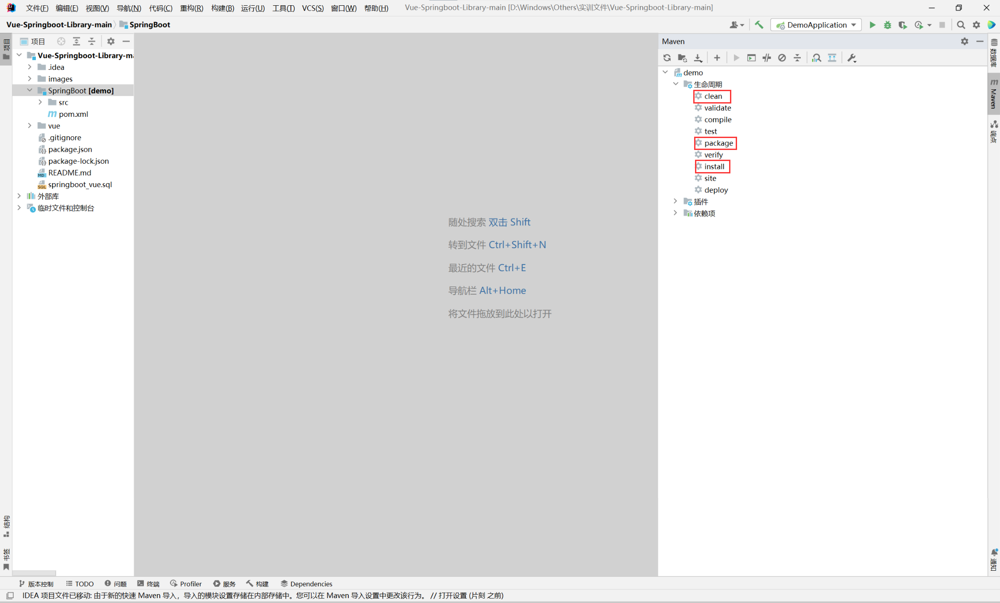

第五步：右键Vue文件夹，打开于 > 终端

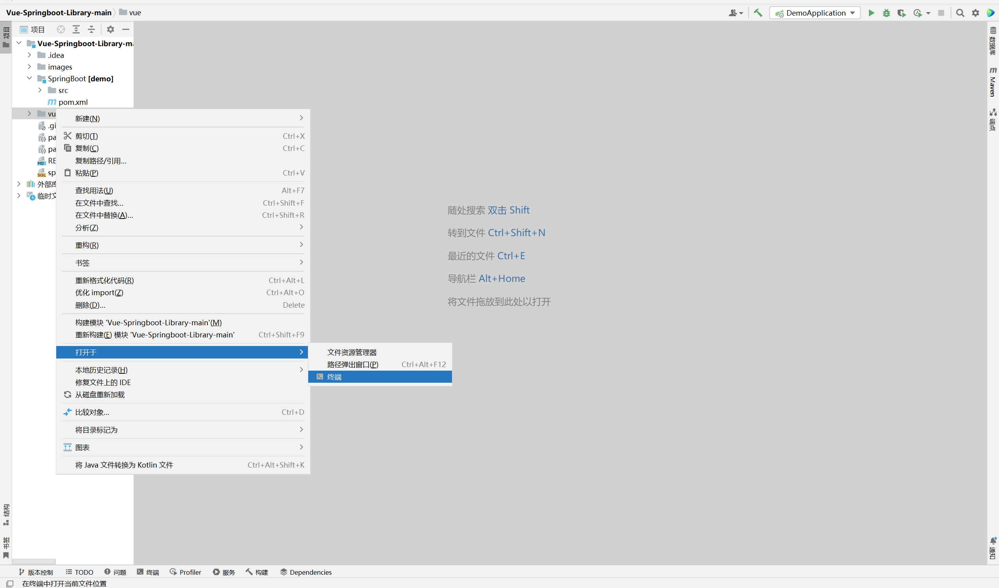

第六步：执行 npm install 和 npm run serve 命令


第七步：**运行后端文件**，前端自动跳到Web网页

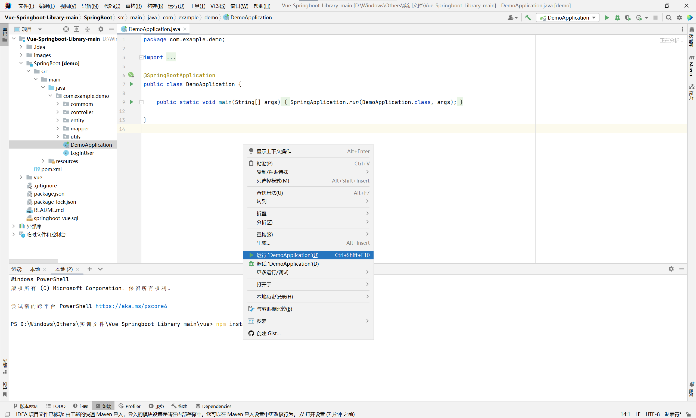


补充：

1.若出现点击登录按键没有反应，F12调取控制台，发现出现404 NOT Found，检查是否正确连接数据库

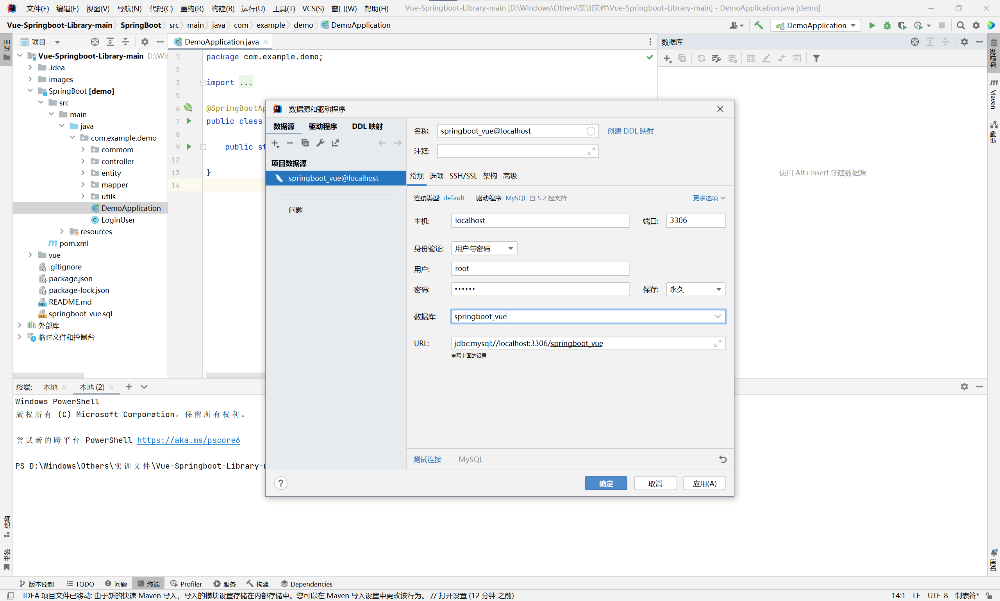

2.若npm install运行后报错，复制最下面npm install......命令，即可成功运行（原因：依赖项没有完全构建）

## 主要技术

Spring Boot、Mybatis-Plus、MySQL、Vue3、ElementPlus等

## 项目结构

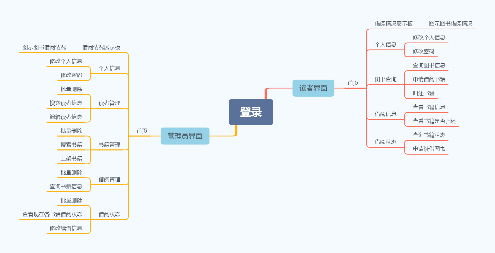

## 技术框架

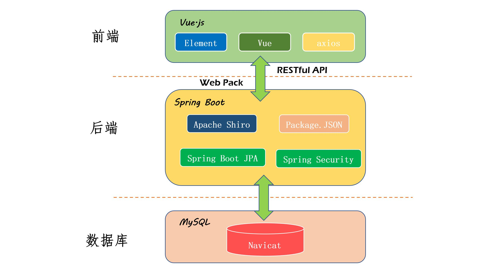

## 主要功能

管理员模块：注册、登录、书籍管理、读者管理、借阅管理、借阅状态、修改个人信息、修改密码

读者模块：注册、登录、查询图书信息、借阅和归还图书、查看个人借阅记录、修改个人信息、修改密码


## 主要功能截图

### 登录

登录支持两种用户角色：管理员和读者

输入正确的账号、密码后，系统会自动识别管理员或者用户，并跳转到相应主页。


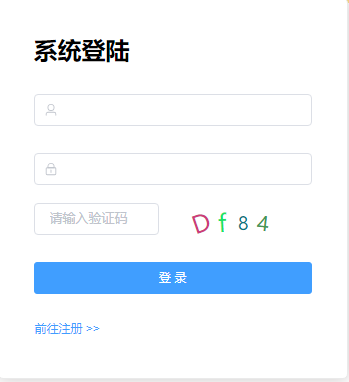


### 展示板页面

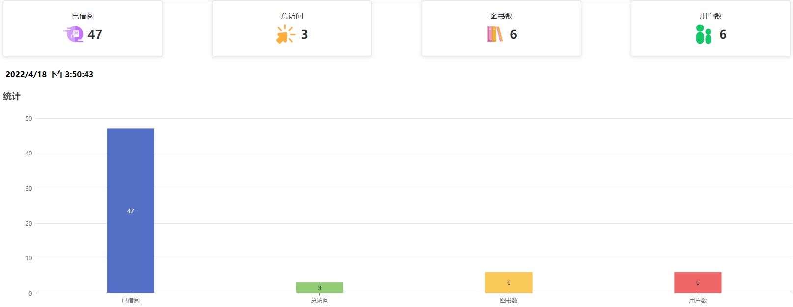

### 管理员界面

#### 图书管理

- 图书表格列表

   

- 添加图书

   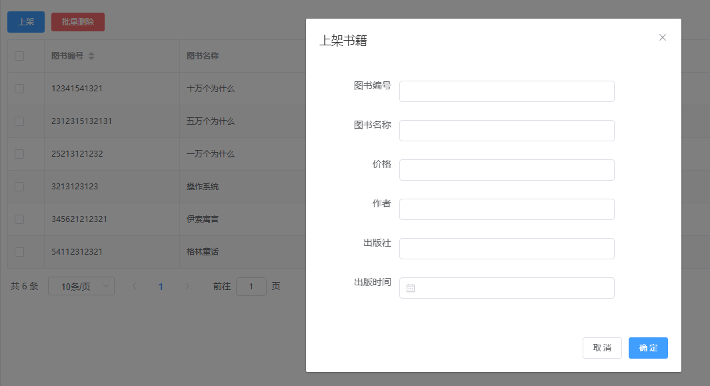

- 编辑图书

   

- 删除图书

   

   


#### 读者管理

- 读者管理的增删查改类似图书管理，不再赘述

  

  

#### 借阅管理

- 借阅记录查询

  

- 借阅记录编辑

  

  #### 借阅状态
  
  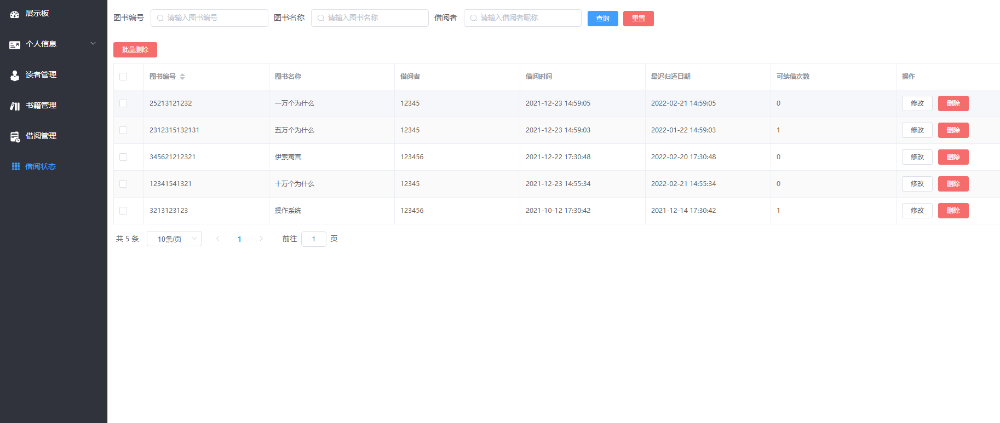


### 读者界面

#### 读者信息

- 编辑个人信息

  

- 修改密码

  点击修改密码按钮，修改密码

  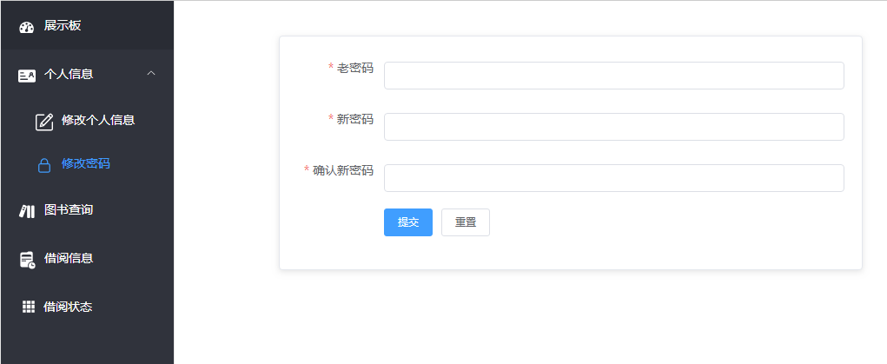


#### 图书查询


#### 借阅图书

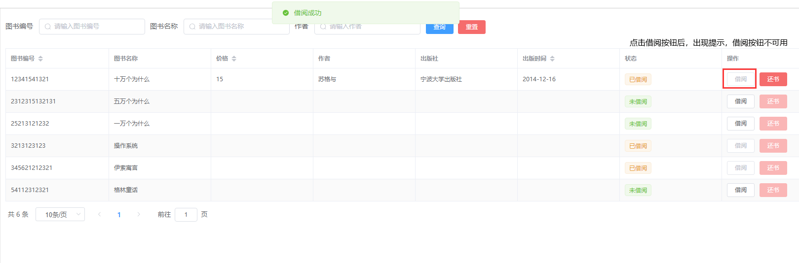

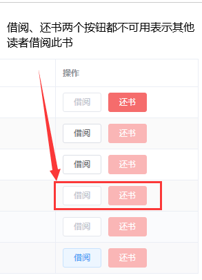

#### 归还图书


#### 借阅记录

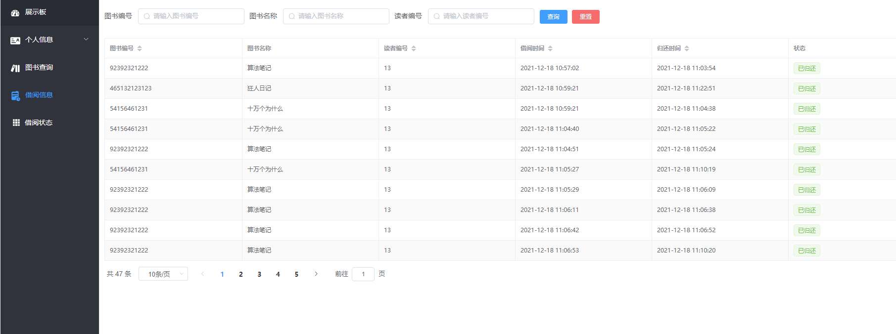

#### 借阅状态

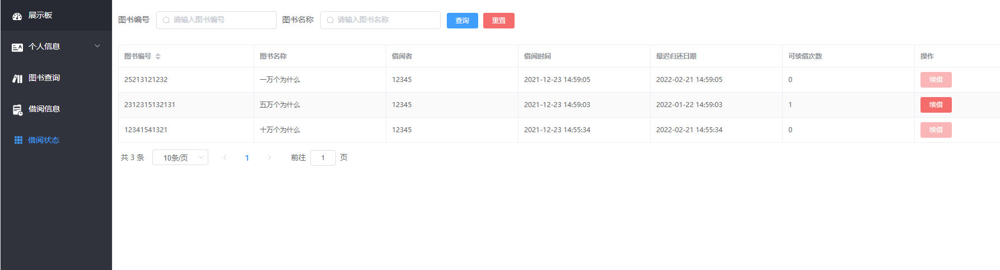


## 代码结构

### 前端

```shell
library-ui
├─api			// api接口
├─assets		// 资源文件	
│  ├─icon	 	// 图标
│  ├─img	 	// 图片
│  └─styles	 	// 样式
├─components	// 自定义Vue组件
├─layout		// 页面布局
├─router		// Vue路由
├─utils			// 工具函数
└─views			// 页面
```

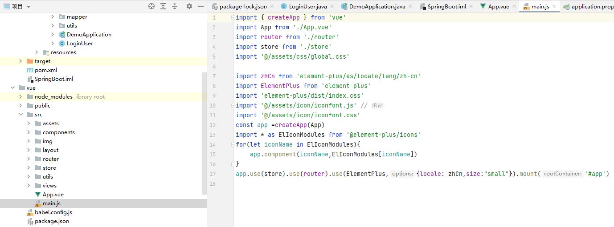


### 后端

maven项目结构

```shell
library-serve
├─java
│  └─com
│      └─admin
│          └─library
│              ├─common			// 通用类
│              │  ├─base		// 基础类
│              │  └─config		// 配置类
│              ├─controller		// 控制层
│              ├─domain			// 实体类
│              ├─mapper			// 持久层
│              └─service		// 业务层
└─resources	// maven资源配置
```


## 数据库

**使用Navicat生成ER模型图**


